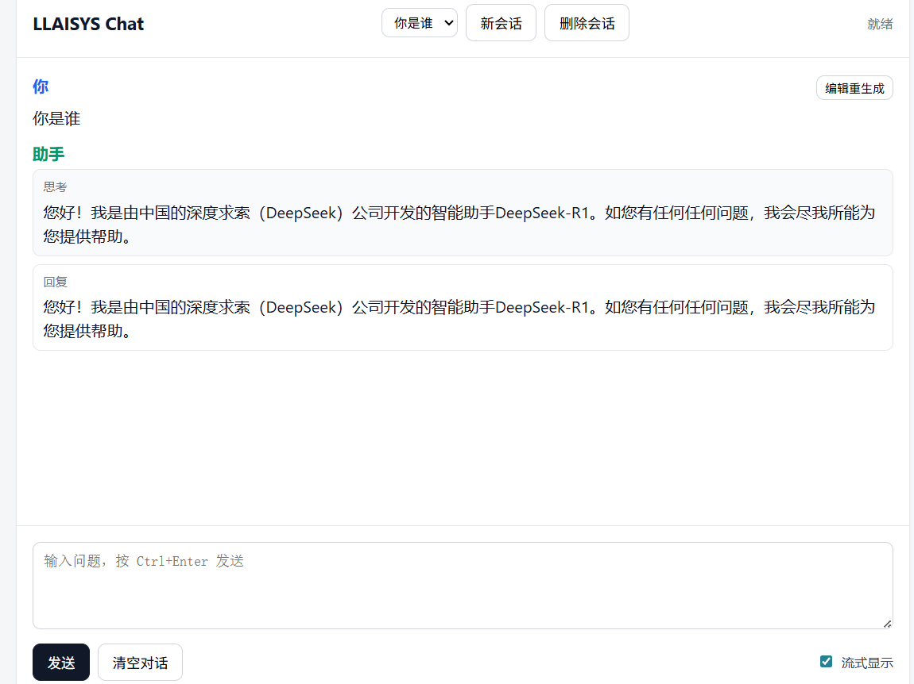

# 本项目基于llaisys实现了一个聊天AI（方向3）
## 项目依赖（与llaisys保持一致）
- 编译工具：[Xmake](https://xmake.io/)
- C++编译器：MSVC（Windows）或Clang或GCC
- Python >= 3.9
## 项目运行
- fork 本仓库
- 编译运行
  ```bash
  # 编译c++代码
  xmake
  # 安装llaisys共享库
  xmake install
  # 安装core包
  python3 -m pip install -e ./python/llaisyscore --user --break-system-packages
  # 安装server包
  python3 -m pip install -e ./python/server-project --user --break-system-packages
  ```
- 从[huggingface](https://huggingface.co/deepseek-ai/DeepSeek-R1-Distill-Qwen-1.5B)手动下载权重并指定权重加载目录（或使用snapshot download下载）
## 实现功能
1. 实现随机采样算子randomsample(sample_val, sample_idx ,logits, temperature, top_k, top_p)
    - temperature：按如下公式 $$ y = t-softmax(x,temperature),\  y_i = \frac{\frac{x_i}{temperature}}{\sum_j \frac{x_j}{temperature}} $$ scale logits的系数
    - top_k：按概率排序(t-softmax归一后的输出)后选择最高k个token作为candidate
    - top_p：经过top_k选取后，再对logits进行一次普通softmax，指定一个累积概率的threshold，累积概率低于这个threshold的token选入candidate
    - output：对经过top_p选取后的logits再使用一次普通softmax，得到最后的token分布，按照分布采样的结果的val和idx写入相应张量
  
2. 基于llaisys实现 Project #3 聊天服务（FastAPI + Web UI）
    - 后端入口：`python/server/app.py`
    - 推理引擎：`python/server/engine.py`
    - 会话与缓存后端：`python/llaisys/backend/inference_backend.py`
    - KV-Cache池：`python/llaisys/models/kvcachepool.py`

## project3 核心实现说明
1. OpenAI风格 chat-completion API
  - `POST /v1/chat/completions`：支持非流式与流式（SSE）返回
  - `GET /healthz`：健康检查
  - `GET /`：返回前端聊天页面

2. 会话管理能力
  - `POST /v1/sessions`：创建会话
  - `GET /v1/sessions`：列出会话
  - `GET /v1/sessions/{session_id}`：读取会话消息
  - `DELETE /v1/sessions/{session_id}`：删除会话
  - `InferenceBackend`中维护`SessionState`，支持`append_message`和`replace_messages`，满足“编辑历史并重生成”需求

3. KVCache复用与前缀匹配
  - 基于trie + session slots实现的Cache pool，前者维护session的tokens prefix，后者维护session的KVCache（并非ref count based的trie，所以prepare的时候会额外多一个复制prefix的开销）
  - 在`KVCachePool.prepare_session`阶段计算当前prompt与历史缓存的最长公共前缀
  - 复用可复用前缀，减少重复prefill
  - 生成完成后通过`commit_session`提交最新token历史
  - 删除会话时同步释放对应cache资源

4. 非流式与流式推理路径
  - 非流式：调用`model.generate(...)`，按输入长度切分`prompt_ids`和`completion_ids`
  - 流式：使用`model._infer_tokens(...)`逐token迭代
    - 首次执行prefill
    - 后续每步单token decode
    - 过滤EOS,'\n'等特殊token，避免前端显示结束标记

5. 前端UI能力（`python/server/ui/index.html`）
  - 多会话切换
  - 用户消息“编辑重生成”
  - 流式开关
  - 对`<think>...</think>`进行分段展示（思考区/回复区）

6. 输出规范化
  - 对流式与非流式输出进行一致性处理
  - 处理`<think>`标签开闭不对称问题
  - 过滤换行符（`\n`）以匹配当前前端展示要求

## 测试与验证
  - 随机采样算子测试文件位于`test/ops/random_sample.py`，主要对random_sample的极端p值（p<=0, p>=1），极端k值（k=1），以及（固定temperature，top_k，top_p组合采样，与pytorch实现进行容差校验）
  - 后端会话与流式行为：`test/test_inference_backend.py`
    - 覆盖会话创建/删除/替换历史
    - 覆盖流式路径“首步prefill + 后续单token解码”
  - 服务端接口行为：`test/test_server.py`
    - 覆盖`healthz`、`/`、`/v1/chat/completions`（流式/非流式）
    - 覆盖`/v1/sessions`增删查
  - 配置行为：`test/test_server_config.py`
    - 覆盖模型路径环境变量存在/不存在时的分支

## 演示效果
1. 启动服务
  ```bash
  cd ./python
  python3 -m uvicorn server.app:app --host 0.0.0.0 --port {port}
  ```
2. 按下面的调用示例或者直接在webgui进行交互
  - 非流式调用示例
    ```bash
    curl -X POST http://127.0.0.1:{port}/v1/chat/completions \
      -H "Content-Type: application/json" \
      -d '{
      "messages": [{"role": "user", "content": "你好，介绍一下你自己"}],
      "stream": false,
      "max_tokens": 64
      }'
    ```

  - 流式调用示例（SSE）
    ```bash
    curl -N -X POST http://127.0.0.1:{port}/v1/chat/completions \
      -H "Content-Type: application/json" \
      -d '{
      "messages": [{"role": "user", "content": "讲个笑话"}],
      "stream": true
      }'
    ```

  - 会话接口示例
    ```bash
    # 创建会话
    curl -X POST http://127.0.0.1:{port}/v1/sessions -H "Content-Type: application/json" -d '{"session_id":"demo-session"}'
    # 查询会话列表
    curl http://127.0.0.1:{port}/v1/sessions
    # 删除会话
    curl -X DELETE http://127.0.0.1:{port}/v1/sessions/demo-session
    # 非流式 chat-completions（指定 session_id）
    curl -X POST http://127.0.0.1:8000/v1/chat/completions \
    -H "Content-Type: application/json" \
    -d '{
    "session_id":"{session_id }",
    "messages":[{"role":"user","content":"你好，介绍一下你自己"}],
    "stream":false,
    "max_tokens":64
    }'
    # 流式 chat-completions（指定 session_id）
    curl -N -X POST http://127.0.0.1:8000/v1/chat/completions \
    -H "Content-Type: application/json" \
    -d '{
    "session_id":"demo-session-001",
    "messages":[{"role":"user","content":"讲个笑话"}],
    "stream":true,
    "max_tokens":64
    }'
    ```
3. webui展示
  

## 说明
- 当前项目3实现聚焦“单实例可用聊天服务 + 会话管理 + KV缓存复用 + 流式输出”。未实现多用户管理及连续批处理等功能。
## todo
- 增加cuda支持
- 项目4跟进


